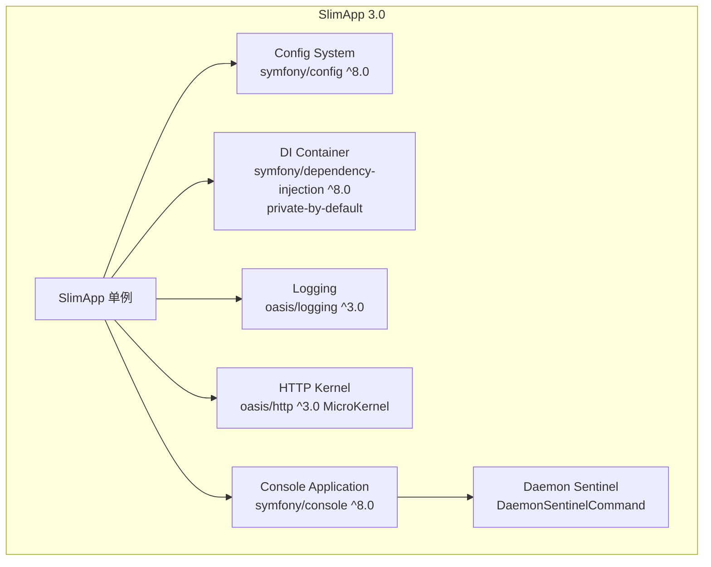

# Design Document: Release 3.0

## Overview

Release 3.0 是 `oasis/slimapp` 的大版本升级，将框架从 PHP 7.0 / Symfony 4.0 / PHPUnit 5.7 技术栈迁移至 PHP 8.5 / Symfony 8.0 / PHPUnit 13。核心变更包括：

1. **依赖全面升级** — PHP >=8.5，Symfony ^8.0，PHPUnit ^13，Doctrine ORM ^3.6，oasis 上游库全部升至最新大版本
2. **HTTP Kernel 替换** — `SilexKernel`（基于 Silex）→ `MicroKernel`（基于 Symfony HttpKernel）
3. **DI 容器现代化** — 移除全 public 服务逻辑，遵循 Symfony 标准 private-by-default 约定
4. **废弃代码清理** — 移除 `AbstractDaemonSentinelCommand`，`DaemonSentinelCommand` 直接继承 `AbstractAlertableCommand`
5. **语法现代化** — `declare(strict_types=1)`、typed properties、return types、`readonly`、`match`、constructor promotion
6. **测试体系升级** — PHPUnit 13 API 适配 + Eris PBT 引入，综合覆盖率 90%+

本设计允许 breaking changes，面向框架维护者和下游项目提供清晰的迁移路径。

---

## Architecture

### 整体架构（升级后）

升级后框架的分层结构保持不变，核心变更集中在 HTTP Kernel 层和 DI 编译器 Pass：



### 关键架构决策

| 决策 | 选择 | 理由 |
|------|------|------|
| HTTP Kernel 替换策略 | 直接替换返回类型为 `MicroKernel` | 大版本升级允许 breaking changes，使用方自行适配 |
| DI 服务可见性 | 移除全 public，`app` 服务保持 public | 遵循 Symfony 标准，迁移指南推荐构造函数注入 |
| `AbstractDaemonSentinelCommand` | 直接移除 | 已 deprecated，`DaemonSentinelCommand` 内联所有逻辑 |
| `readonly` 使用策略 | 仅对确定不会被重新赋值的属性 | `resetService()` 涉及的属性除外 |
| PBT 配置解析测试 | 提取配置解析逻辑为独立可测试单元 | `init()` 依赖文件系统和 DI 编译，不适合直接 PBT |

---

## Components and Interfaces

### 1. SlimApp（核心单例）

**变更摘要**：
- `$silexKernel` 属性 → `$microKernel`，类型从 `SilexKernel` 改为 `MicroKernel`
- `getHttpKernel()` 返回类型声明为 `MicroKernel`
- 所有属性添加类型声明
- 适当属性添加 `readonly`（排除 `resetService()` 涉及的属性）
- `setHttpProperty()` 中 `$this->silexKernel = null` → `$this->microKernel = null`

```php
declare(strict_types=1);

namespace Oasis\SlimApp;

use Oasis\Mlib\Http\MicroKernel;

class SlimApp
{
    protected bool $isDebugMode = false;
    protected array $configs = [];
    protected ?ArrayDataProvider $configDataProvider = null;
    protected ?Container $container = null;
    protected ?string $loggingPath = null;
    protected int $loggingLevel = Logger::DEBUG;
    protected string $loggingPattern = '%date%/%script%.%type%';
    protected ?ConsoleApplication $consoleApp = null;
    protected array $consoleConfig = [];
    protected ?MicroKernel $microKernel = null;
    protected ?array $httpConfig = null;
    protected ?string $configPath = null;
    protected string $configFilename = 'config.yml';
    protected string $serviceFilename = 'services.yml';
    protected string $configCachePath = '';
    protected array $configRelatedResources = [];

    public function getHttpKernel(): MicroKernel
    {
        if (!$this->microKernel instanceof MicroKernel) {
            $this->microKernel = new MicroKernel($this->httpConfig, $this->isDebugMode);
            $this->microKernel->addControllerInjectedArg($this);
            $this->microKernel->addExtraParameters($this->container->getParameterBag()->all());
        }
        return $this->microKernel;
    }
    // ...
}
```

**MicroKernel API 假设**（基于 SilexKernel 的等价接口）：

`oasis/http` v3.0 的 `MicroKernel` 预期提供与 `SilexKernel` 等价的公共 API：
- `__construct(array $httpConfig, bool $isDebug)` — 构造函数签名保持一致
- `addControllerInjectedArg(object $arg): void` — 注入控制器参数
- `addExtraParameters(array $params): void` — 注入额外参数
- `run(?Request $request = null): void` — 启动 HTTP 处理
- `getCacheDirectories(): array` — 返回缓存目录列表（优先使用）
- 如果 `getCacheDirectories()` 不存在，则使用 `getCacheDir(): string` 作为备选

### 2. SlimAppCompilerPass（DI 编译器 Pass）

**变更摘要**：
- 移除 `$definition->setPublic(true)` 循环
- 保留 `default.namespace` 类解析逻辑
- 保留 `app` 服务自动注册逻辑（设置 class 和 factory）
- `app` 服务显式设为 public

```php
declare(strict_types=1);

namespace Oasis\SlimApp;

class SlimAppCompilerPass implements CompilerPassInterface
{
    public function __construct(
        protected readonly string $classname,
    ) {}

    public function process(ContainerBuilder $container): void
    {
        if ($container->hasParameter('default.namespace')) {
            $defaultNamespaces = $container->getParameter('default.namespace');
            if (is_string($defaultNamespaces)) {
                $defaultNamespaces = [$defaultNamespaces];
            }

            foreach ($container->getDefinitions() as $id => $definition) {
                // app 服务：设置 class、factory、保持 public
                if ($id === 'app') {
                    $definition->setClass($this->classname);
                    $definition->setFactory([$this->classname, 'app']);
                    $definition->setPublic(true);
                    continue;
                }

                // 不再调用 $definition->setPublic(true)
                // 服务可见性保持其声明值（默认 private）

                // default.namespace 类解析逻辑（保持不变）
                // ...
            }
        }
    }
}
```

**提取的命名空间解析纯函数**（用于 PBT）：

```php
declare(strict_types=1);

namespace Oasis\SlimApp;

class NamespaceResolver
{
    /**
     * 给定一个短类名和命名空间列表，尝试解析为完整类名。
     * 如果在任何命名空间下找到存在的类，返回 FQCN；否则返回原始输入。
     */
    public static function resolve(string $className, array $namespaces): string
    {
        $className = ltrim($className, '\\');

        if (class_exists($className) || class_exists('\\' . $className)) {
            return $className;
        }

        foreach ($namespaces as $ns) {
            $ns = trim($ns, '\\');
            $fullClass = $ns . '\\' . $className;
            if (class_exists($fullClass)) {
                return $fullClass;
            }
        }

        return $className;
    }
}
```

### 3. DaemonSentinelCommand（重构后）

**变更摘要**：
- 直接继承 `AbstractAlertableCommand`（不再继承 `AbstractDaemonSentinelCommand`）
- 内联所有 sentinel 执行逻辑（从 `AbstractDaemonSentinelCommand` 移入）
- 添加类型声明和 PHP 8.5 语法

```php
declare(strict_types=1);

namespace Oasis\SlimApp\SentinelCommand;

use Oasis\SlimApp\AbstractAlertableCommand;

class DaemonSentinelCommand extends AbstractAlertableCommand
{
    /** @var CommandRunner[] */
    protected array $runningProcesses = [];

    protected function configure(): void
    {
        parent::configure();
        $this->setDescription('Runs as sentinel for a list of daemon commands');
        $this->addArgument('file', InputArgument::REQUIRED, 'a config file holding daemon commands info');
    }

    protected function execute(InputInterface $input, OutputInterface $output): int
    {
        // 完整的 sentinel 执行逻辑（从 AbstractDaemonSentinelCommand 移入）
        // ...
    }

    protected function waitForBackgroundProcesses(): void
    {
        // 完整的进程等待逻辑（从 AbstractDaemonSentinelCommand 移入）
        // ...
    }
}
```

### 4. ClearCacheCommand（适配 MicroKernel）

**变更摘要**：
- 将 `$slimapp->getHttpKernel()->getCacheDirectories()` 调用适配为 MicroKernel API
- 优先使用 `getCacheDirectories()`，如果不存在则使用 `getCacheDir()`

```php
protected function execute(InputInterface $input, OutputInterface $output): int
{
    $console = $this->getApplication();
    assert($console instanceof ConsoleApplication);
    $slimapp = $console->getSlimapp();

    $cacheDirs = [$slimapp->getConfigCachePath()];

    $httpKernel = $slimapp->getHttpKernel();
    if (method_exists($httpKernel, 'getCacheDirectories')) {
        $httpCacheDirs = $httpKernel->getCacheDirectories();
    } elseif (method_exists($httpKernel, 'getCacheDir')) {
        $httpCacheDirs = [$httpKernel->getCacheDir()];
    } else {
        $httpCacheDirs = [];
    }
    $cacheDirs = array_merge($cacheDirs, $httpCacheDirs);

    // ... 清除逻辑保持不变
    return 0;
}
```

### 5. ConsoleApplication（语法升级）

**变更摘要**：
- 添加类型声明
- `configureIO()` 中的 `switch` 改为 `match` 表达式

```php
protected function configureIO(InputInterface $input, OutputInterface $output): void
{
    parent::configureIO($input, $output);

    $level = match ($output->getVerbosity()) {
        OutputInterface::VERBOSITY_QUIET       => Logger::CRITICAL,
        OutputInterface::VERBOSITY_NORMAL      => Logger::WARNING,
        OutputInterface::VERBOSITY_VERBOSE     => Logger::NOTICE,
        OutputInterface::VERBOSITY_VERY_VERBOSE => Logger::INFO,
        OutputInterface::VERBOSITY_DEBUG       => Logger::DEBUG,
        default                                => Logger::DEBUG,
    };

    if ($this->loggingEnabled) {
        $handler = new ConsoleHandler($level);
        $handler->install();
    }
}
```

### 6. 提取的配置解析单元（新增，用于 PBT）

为满足 Req 7.5 的 round-trip PBT 需求，从 `SlimApp::init()` 中提取配置解析逻辑为独立可测试单元：

```php
declare(strict_types=1);

namespace Oasis\SlimApp;

use Symfony\Component\Config\Definition\ConfigurationInterface;
use Symfony\Component\Config\Definition\Processor;

class ConfigParser
{
    /**
     * 解析原始配置数组，返回处理后的配置。
     *
     * @param array $rawConfigs 原始配置数组（可多个，会被 merge）
     * @param ConfigurationInterface $definition 配置定义
     * @return array 处理后的配置树
     */
    public static function parse(array $rawConfigs, ConfigurationInterface $definition): array
    {
        $processor = new Processor();
        return $processor->processConfiguration($definition, $rawConfigs);
    }

    /**
     * 将配置树扁平化为 key => value 的参数映射。
     *
     * @param array $configs 配置树
     * @param string $prefix 前缀（默认 'app.'）
     * @return array<string, mixed> 扁平化后的参数映射
     */
    public static function flatten(array $configs, string $prefix = 'app.'): array
    {
        $result = [];
        $recurse = function (array $value, string $prefix) use (&$result, &$recurse): void {
            foreach ($value as $k => $v) {
                $result[$prefix . $k] = $v;
                if (is_array($v)) {
                    $recurse($v, $prefix . $k . '.');
                }
            }
        };
        $recurse($configs, $prefix);
        return $result;
    }

    /**
     * 从扁平化参数中按 key 检索值。
     *
     * @param array<string, mixed> $flatParams 扁平化参数
     * @param string $key 参数 key（如 'app.dir.log'）
     * @return mixed
     */
    public static function retrieve(array $flatParams, string $key): mixed
    {
        return $flatParams[$key] ?? null;
    }
}
```

**Round-trip 属性**：对于任何有效配置树 `$config`，`ConfigParser::retrieve(ConfigParser::flatten($config), 'app.' . $key)` 应等于 `$config` 中对应路径的值。

### 7. CommandRunner（语法升级 + 调度逻辑提取）

为满足 Req 7.4 的 PBT 需求，将 `onProcessExit()` 中的 `nextRun` 计算逻辑保持在 `CommandRunner` 中，但确保其可通过反射或公开方法进行测试。

调度规则（形式化）：
- 如果 `once = true`：`stopped = true`，不再调度
- 如果 `once = false`：
  - `nextRun = time()`
  - 如果 `frequency > 0` 且 `nextRun - lastRun < frequency`：`nextRun = lastRun + frequency`
  - 如果 `interval > 0` 且 `nextRun - time() < interval`：`nextRun = time() + interval`

### 8. CommandConfiguration（TreeBuilder API 升级）

**变更摘要**：
- `getConfigTreeBuilder()` 从 deprecated 的 `new TreeBuilder()` + `$builder->root('daemon-monitor')` 改为 Symfony 8.0 API：`new TreeBuilder('daemon-monitor')`
- 添加 `declare(strict_types=1)` 和类型声明

```php
declare(strict_types=1);

namespace Oasis\SlimApp\SentinelCommand;

class CommandConfiguration implements ConfigurationInterface
{
    public function __construct(
        private readonly Application $application,
    ) {}

    public function getConfigTreeBuilder(): TreeBuilder
    {
        $builder = new TreeBuilder('daemon-monitor');
        $root = $builder->getRootNode();
        // ... 其余配置定义逻辑保持不变
        return $builder;
    }
}
```

### 9. ValidateServicesCommand（适配 private-by-default）

**变更摘要**：
- 移除全 public 后，`getServiceIds()` 仅返回 public 服务 ID
- 命令行为自然收窄为只验证 public 服务，这是预期行为
- 添加类型声明

```php
protected function execute(InputInterface $input, OutputInterface $output): int
{
    $console = $this->getApplication();
    assert($console instanceof ConsoleApplication);
    $slimapp = $console->getSlimapp();

    $ids = $slimapp->getServiceIds();
    foreach ($ids as $id) {
        try {
            $output->writeln("Validating <comment>$id</comment> ...");
            $slimapp->getService($id);
            $output->writeln('<info>Done.</info>');
        } catch (\Exception $e) {
            $output->writeln(
                "<error>Service $id is misconfigured, exception = \n" . $e->getTraceAsString() . '</error>'
            );
        }
    }

    return 0;
}
```

### 10. 文档更新方案（Req 10）

| 文档 | 变更内容 |
|------|----------|
| `docs/state/architecture.md` | HTTP Kernel 段落：SilexKernel → MicroKernel；DI 容器段落：移除"所有服务设为 public"，改为"默认 private，`app` 服务保持 public"；Daemon Sentinel 段落：移除 AbstractDaemonSentinelCommand 引用 |
| `docs/state/cli-commands.md` | Command 基类体系图：移除 AbstractDaemonSentinelCommand 层级，DaemonSentinelCommand 直接继承 AbstractAlertableCommand；ValidateServicesCommand 说明更新为"验证所有 public 服务" |
| `docs/state/configuration.md` | DI 可见性变更说明：服务默认 private，需要通过 `getService()` 获取的服务须在 `services.yml` 中声明 `public: true` |
| `PROJECT.md` | 技术栈更新：PHP >=8.5、Symfony ^8.0、PHPUnit ^13、oasis 上游库版本；移除 AbstractDaemonSentinelCommand 引用 |
| `README.md` | PHP 版本要求、主要依赖版本更新 |

### 11. 迁移指南结构设计（Req 11）

文件路径：`docs/manual/migration-v2-to-v3.md`

```markdown
# Migration Guide: slimapp 2.x → 3.0

## 依赖变更清单
（表格：依赖名 | 2.x 版本 | 3.0 版本）

## Breaking Changes

### 1. PHP 版本要求
- PHP >=7.0 → PHP >=8.5

### 2. HTTP Kernel 变更
- `getHttpKernel()` 返回类型从 `SilexKernel` 改为 `MicroKernel`
- 使用方代码中的 `SilexKernel` 类型提示需更新
- MicroKernel API 与 SilexKernel 等价方法对照

### 3. DI 容器可见性变更
- 服务默认从 public 改为 private
- `getService()` 仅适用于显式声明为 public 的服务
- 推荐使用构造函数注入替代 `getService()`
- `app` 服务保持 public，但建议迁移到构造函数注入

### 4. AbstractDaemonSentinelCommand 移除
- 直接使用 DaemonSentinelCommand 或继承它
- 如有自定义子类继承 AbstractDaemonSentinelCommand，改为继承 DaemonSentinelCommand

### 5. PHPUnit 升级
- PHPUnit 5.7 → 13 的 API 变更清单
- 基类、断言方法、Mock API 变更

## 升级步骤清单
（有序列表：逐步操作指引）
```

---

## Data Models

### composer.json（目标状态）

```json
{
    "require": {
        "php": ">=8.5",
        "symfony/dependency-injection": "^8.0",
        "symfony/config": "^8.0",
        "symfony/console": "^8.0",
        "symfony/finder": "^8.0",
        "symfony/filesystem": "^8.0",
        "oasis/logging": "^3.0",
        "oasis/utils": "^3.0",
        "oasis/http": "^3.0"
    },
    "require-dev": {
        "phpunit/phpunit": "^13",
        "doctrine/orm": "^3.6",
        "oasis/aws-wrappers": "^3.0",
        "oasis/dynamodb-odm": "^2.0",
        "oasis/doctrine-addon": "^3.1",
        "giorgiosironi/eris": "^1.1"
    }
}
```

### phpunit.xml（目标状态）

```xml
<?xml version="1.0" encoding="UTF-8"?>
<phpunit xmlns:xsi="http://www.w3.org/2001/XMLSchema-instance"
         xsi:noNamespaceSchemaLocation="https://schema.phpunit.de/13.0/phpunit.xsd"
         bootstrap="tests/bootstrap.php"
         colors="true"
         failOnWarning="true"
         failOnRisky="true">
    <testsuites>
        <testsuite name="ut">
            <directory suffix="Test.php">tests/ut</directory>
        </testsuite>
        <testsuite name="pbt">
            <directory suffix="Test.php">tests/pbt</directory>
        </testsuite>
    </testsuites>
    <source>
        <include>
            <directory suffix=".php">src</directory>
        </include>
        <exclude>
            <directory suffix=".php">src/tests</directory>
            <file>src/BuiltInCommands/InitializeProjectCommand.php</file>
        </exclude>
    </source>
    <coverage>
        <report>
            <text outputFile="php://stdout" showOnlySummary="true"/>
        </report>
    </coverage>
</phpunit>
```

### 测试目录结构（目标状态）

```
tests/
├── bootstrap.php                    # PHPUnit 13 兼容
├── ut/                              # 单元测试
│   ├── BuiltInCommands/
│   ├── SentinelCommand/
│   │   └── DaemonSentinelCommandTest.php  # 重写（不再引用 Abstract）
│   ├── ConsoleApplicationTest.php
│   ├── SlimAppTest.php
│   ├── SlimAppCompilerPassTest.php
│   ├── CommandConfigurationTest.php
│   ├── CommandRunnerTest.php
│   ├── ConfigParserTest.php         # 新增
│   └── NamespaceResolverTest.php    # 新增
├── pbt/                             # Property-Based Testing（新增）
│   ├── CommandConfigurationPbtTest.php
│   ├── CommandRunnerSchedulingPbtTest.php
│   ├── ConfigParserPbtTest.php
│   ├── NamespaceResolverPbtTest.php
│   └── VerbosityMappingPbtTest.php
├── integration/                     # 集成测试
│   ├── bootstrap.php
│   ├── config/
│   ├── fixtures/
│   ├── console.php
│   └── http.php
├── scripts/                         # 覆盖率合并等脚本
│   ├── merge_coverage.php
│   ├── parallel_command_test.php
│   └── sentinel_command_test.php
└── run_all_coverage.sh              # 全量覆盖率脚本
```

---

## Correctness Properties

*A property is a characteristic or behavior that should hold true across all valid executions of a system — essentially, a formal statement about what the system should do. Properties serve as the bridge between human-readable specifications and machine-verifiable correctness guarantees.*

### Property 1: CommandConfiguration 处理幂等性

*For any* valid command configuration array（包含 name、args、parallel、once、alert、interval、frequency、frequency_fixed 字段），使用 Symfony Processor 处理一次得到结果 R1，再将 R1 作为输入处理第二次得到 R2，则 R1 SHALL 等于 R2。

**Validates: Requirements 7.3**

### Property 2: CommandRunner 调度约束

*For any* 非 once 的 CommandRunner 实例，给定 `lastRun` 时间戳和当前时间 `now`，调用 `onProcessExit()` 后的 `nextRun` 值 SHALL 满足以下约束：
- 当 `frequency > 0` 时：`nextRun >= lastRun + frequency`
- 当 `interval > 0` 时：`nextRun >= now + interval`
- 当 `frequency = 0` 且 `interval = 0` 时：`nextRun` 约等于 `now`（误差 ≤ 1 秒）

**Validates: Requirements 7.4**

### Property 3: 配置解析 Round-Trip

*For any* 有效配置树（由 ConfigurationInterface 定义约束的随机值组成），将其通过 `ConfigParser::parse()` 处理后再通过 `ConfigParser::flatten()` 扁平化，对于配置树中每个叶子节点路径 `path`，`ConfigParser::retrieve(flattened, 'app.' + path)` SHALL 等于原始配置树中该路径对应的值。

**Validates: Requirements 7.5**

### Property 4: 命名空间解析 Metamorphic 属性

*For any* 类名 `className` 和命名空间数组 `namespaces`，`NamespaceResolver::resolve(className, namespaces)` 的结果 SHALL 满足以下条件之一：
- 结果是一个存在的完全限定类名（`class_exists(result) === true`）
- 结果等于原始输入 `className`

**Validates: Requirements 4.1, 7.6**

### Property 5: Verbosity-to-LogLevel 全函数属性

*For any* 有效的 Symfony OutputInterface verbosity 常量（QUIET、NORMAL、VERBOSE、VERY_VERBOSE、DEBUG），`ConsoleApplication` 的 verbosity 映射 SHALL 产生一个有效的 Monolog Logger 级别常量（属于 `[DEBUG, INFO, NOTICE, WARNING, ERROR, CRITICAL, ALERT, EMERGENCY]` 之一）。

**Validates: Requirements 7.7**

---

## Error Handling

### HTTP Kernel 缓存清理容错

`ClearCacheCommand` 在获取 MicroKernel 缓存目录时采用防御性策略：
1. 优先调用 `getCacheDirectories()`
2. 如果方法不存在，回退到 `getCacheDir()`
3. 如果两者都不存在，跳过 HTTP 缓存清理（仅清理 SlimApp 自身的 configCachePath）

这确保即使 MicroKernel API 与预期不完全一致，命令也不会崩溃。

### DI 容器服务获取

移除全 public 后，`getService()` 调用非 public 服务将抛出 `ServiceNotFoundException`（Symfony 标准行为）。这是预期的 breaking change，迁移指南中需明确说明。

### 配置解析错误

`ConfigParser::parse()` 在配置不符合 schema 时将抛出 `InvalidConfigurationException`（Symfony 标准行为）。PBT 生成器需确保生成的配置符合 schema 约束。

### Sentinel 进程管理

`DaemonSentinelCommand` 的进程管理错误处理保持不变：
- `pcntl_fork()` 失败 → 抛出 `RuntimeException`
- 子进程异常退出 → 根据 `alert` 配置发送 alert 或 warning
- `pcntl_waitpid()` 错误 → `PCNTL_ECHILD` 表示所有子进程已结束，其他错误抛出 `RuntimeException`

---

## Testing Strategy

### 测试分层

| 层 | 目录 | 工具 | 目标 |
|----|------|------|------|
| Unit Tests | `tests/ut/` | PHPUnit 13 | 具体示例、边界条件、错误路径 |
| Property-Based Tests | `tests/pbt/` | PHPUnit 13 + Eris ^1.1 | 通用属性、大量随机输入 |
| Integration Tests | `tests/integration/` + `tests/scripts/` | PHPUnit 13 + 独立脚本 | 端到端行为、fork 进程 |

### PBT 配置

- **库**: `giorgiosironi/eris` ^1.1
- **最小迭代次数**: 每个 property test 100 次
- **标签格式**: `Feature: release-3.0, Property {N}: {property_text}`

### PBT 测试文件规划

| 文件 | 测试的 Property | 生成器策略 |
|------|----------------|-----------|
| `CommandConfigurationPbtTest.php` | Property 1 (幂等性) | 生成随机 command name (string)、args (array)、parallel (int 1-10)、once/alert/frequency_fixed (bool)、interval/frequency (int 0-300) |
| `CommandRunnerSchedulingPbtTest.php` | Property 2 (调度约束) | 生成随机 once (bool)、interval (int 0-300)、frequency (int 0-300)、frequency_fixed (bool)、lastRun (int time()-600..time())、exitStatus (int 0-255) |
| `ConfigParserPbtTest.php` | Property 3 (Round-trip) | 生成随机配置树：叶子值为 string/int/bool，嵌套深度 1-3 层，key 为合法 YAML key |
| `NamespaceResolverPbtTest.php` | Property 4 (Metamorphic) | 生成随机短类名 (string) 和命名空间数组 (string[])，混合存在/不存在的类名 |
| `VerbosityMappingPbtTest.php` | Property 5 (全函数) | 从 5 个有效 verbosity 常量中随机选择 |

### Unit Test 重点

- **SlimAppCompilerPass**: 验证 `app` 服务 public、其他服务保持声明的可见性、namespace 解析正确
- **DaemonSentinelCommand**: 验证继承关系、command 定义、空配置执行
- **ClearCacheCommand**: 验证 MicroKernel 缓存目录获取的容错逻辑
- **ConsoleApplication**: 验证 verbosity 映射、日志配置
- **ConfigParser**: 验证 parse/flatten/retrieve 的基本行为

### Integration Test 适配

- `TestAppConfig` 更新为 Symfony 8.0 TreeBuilder API（`new TreeBuilder('app')` 替代 `$builder->root('app')`）
- `services.yml` 中需要通过 `getService()` 获取的服务添加 `public: true`
- 所有 fixture 类添加 `declare(strict_types=1)` 和类型声明
- fork 测试脚本适配 PHPUnit 13 的覆盖率 API

### 覆盖率策略

- **排除**: `InitializeProjectCommand`、`src/tests/` 目录
- **合并**: `tests/run_all_coverage.sh` 合并 ut + pbt + integration 覆盖率
- **目标**: 综合 90%+ line coverage
- **报告**: text 格式输出到 stdout（CI 可解析）

### PHPUnit 13 迁移清单

| 旧 API | 新 API |
|--------|--------|
| `\PHPUnit_Framework_TestCase` | `\PHPUnit\Framework\TestCase` |
| `setExpectedException(Class)` | `expectException(Class)` |
| `setExpectedException(Class, msg)` | `expectException(Class)` + `expectExceptionMessage(msg)` |
| `assertInternalType('array', $v)` | `assertIsArray($v)` |
| `getMockBuilder(X)->getMock()` | `createMock(X)` 或 `createStub(X)` |
| `setUp()` (无返回类型) | `setUp(): void` |
| `phpunit.xsd` 5.7 schema | `phpunit.xsd` 13.0 schema |
| `<filter><whitelist>` | `<source><include>/<exclude>` |
| `<logging><log type="coverage-text">` | `<coverage><report><text>` |

---

## Impact Analysis

### 受影响的 State 文档

| 文档 | 受影响 Section | 变更类型 |
|------|---------------|----------|
| `docs/state/architecture.md` | HTTP Kernel、DI 容器、Daemon Sentinel、Command 基类体系 | 内容更新 |
| `docs/state/cli-commands.md` | Command 基类体系图、ValidateServicesCommand 描述 | 内容更新 |
| `docs/state/configuration.md` | DI 容器服务可见性说明 | 内容更新 |
| `PROJECT.md` | 技术栈、依赖版本、目录结构 | 内容更新 |
| `README.md` | PHP 版本、依赖版本 | 内容更新 |

### 现有行为变化

| 组件 | 变化 | Breaking? |
|------|------|-----------|
| `SlimApp::getHttpKernel()` | 返回类型从 `SilexKernel` 改为 `MicroKernel` | ✅ Yes |
| `SlimApp::getService()` | 仅能获取 public 服务，非 public 服务抛出 `ServiceNotFoundException` | ✅ Yes |
| `SlimAppCompilerPass` | 不再将所有服务设为 public | ✅ Yes |
| `ValidateServicesCommand` | 仅验证 public 服务（因 `getServiceIds()` 行为变化） | ✅ Yes |
| `DaemonSentinelCommand` | 继承链变更（不再经过 AbstractDaemonSentinelCommand），但外部行为不变 | ⚠️ 仅影响直接继承 AbstractDaemonSentinelCommand 的下游代码 |
| `CommandConfiguration::getConfigTreeBuilder()` | TreeBuilder API 升级（内部变更，外部行为不变） | ❌ No |
| `ConsoleApplication::configureIO()` | switch → match（内部重构，外部行为不变） | ❌ No |

### 数据模型变更

- **不涉及运行时数据模型变更**。配置缓存文件（`container.php`、`config.cache`）会因 Symfony 8.0 的序列化格式变化而不兼容旧缓存，但这些文件是自动生成的，升级后首次运行会自动重建。
- 建议：升级后执行 `slimapp:cache:clear` 清除旧缓存。

### 外部系统交互

- **不涉及外部系统交互变化**。框架本身不直接与外部系统通信，外部交互由使用方项目的服务定义决定。

### 配置项变更

| 配置项 | 变更 |
|--------|------|
| `services.yml` 中的服务定义 | 需要通过 `getService()` 获取的服务须显式添加 `public: true` |
| `phpunit.xml` | schema 升级、coverage 配置格式变更（见 Data Models 中的目标状态） |
| `composer.json` | 所有依赖版本升级（见 Data Models 中的目标状态） |

### Graphify 辅助分析

基于 graphify 报告，`SlimApp` 是 god node（19 edges），与 `ClearCacheCommand`、`ValidateServicesCommand`（Community 0）、`ConsoleApplication`（Community 5）、`SlimAppCompilerPass`（Community 8）紧密关联。本次变更覆盖了所有这些核心节点。

`AbstractDaemonSentinelCommand` 与 `CommandRunner` 同属 Community 6（Daemon Sentinel Runtime），移除 AbstractDaemonSentinelCommand 后，`DaemonSentinelCommand` 直接与 `CommandRunner` 交互，不影响 Community 内部的依赖关系。

`TestAppConfig`（Community 14）、`TestSentinelCommand`（Community 13）、`DummyCommand`（Community 11）、`TestController`（Community 12）均为测试 fixture，需要同步适配但不影响生产代码。

---

## Alternatives Considered

### HTTP Kernel 替换策略

| 方案 | 描述 | 落选理由 |
|------|------|----------|
| **A) 直接替换（已选）** | `getHttpKernel()` 返回类型直接改为 `MicroKernel` | — |
| B) 适配层 | 引入 `HttpKernelInterface` 抽象层 | 过度设计，框架只有一个 HTTP Kernel 实现 |
| C) 移除 HTTP Kernel | 不再内置 HTTP 支持 | 破坏框架核心功能 |

### DI 服务可见性

| 方案 | 描述 | 落选理由 |
|------|------|----------|
| **A) 移除全 public + app 保持 public（已选）** | 遵循 Symfony 标准 | — |
| B) 继续全 public | 保持向后兼容 | 违反 Symfony 最佳实践，大版本升级应修正 |
| C) 提供配置开关 | 允许使用方选择 public/private 模式 | 增加复杂度，无实际价值 |

### PBT 配置解析测试层面

| 方案 | 描述 | 落选理由 |
|------|------|----------|
| A) 端到端 PBT | 对 `init()` 使用临时文件系统 | 依赖文件系统和 DI 编译，测试过重 |
| **B) 提取独立单元（已选）** | 提取 `ConfigParser` 类 | — |
| C) 仅测试 getter | 测试 `getMandatoryConfig()` / `getOptionalConfig()` | 覆盖面不足，无法验证 round-trip |

---

## Socratic Review

### design 是否完整覆盖了 requirements 中的每条需求？

Req 1–9 均有对应的技术方案（组件设计、数据模型、测试策略）。Req 10（文档更新）和 Req 11（迁移指南）在组件 10、11 中给出了具体的变更清单和结构设计。所有 11 条 requirement 均已覆盖。

### 技术选型是否合理？

- MicroKernel 替换：唯一选择，`oasis/http` v3.0 已移除 SilexKernel
- ConfigParser 提取：合理，`init()` 的文件系统依赖使其不适合 PBT
- NamespaceResolver 提取：合理，将纯逻辑从 CompilerPass 中分离便于测试
- Eris ^1.1：与上游 oasis 库一致，已验证兼容 PHPUnit 13

### 接口签名和数据模型是否足够清晰？

- `SlimApp::getHttpKernel(): MicroKernel` — 明确
- `SlimAppCompilerPass::process(ContainerBuilder): void` — 明确
- `ConfigParser::parse/flatten/retrieve` — 参数类型和返回类型完整
- `NamespaceResolver::resolve(string, array): string` — 明确
- `CommandConfiguration::getConfigTreeBuilder(): TreeBuilder` — 明确

### 模块间的依赖关系是否会引入循环依赖？

不会。新增的 `ConfigParser` 和 `NamespaceResolver` 是无状态的纯函数类，不依赖其他框架组件。`SlimApp` 调用 `ConfigParser`（单向），`SlimAppCompilerPass` 调用 `NamespaceResolver`（单向）。

### 是否有过度设计的部分？

- `ConfigParser` 和 `NamespaceResolver` 的提取是为了满足 PBT 需求，不是预留的扩展点
- 未引入不必要的抽象层（如 HTTP Kernel 适配层）
- ClearCacheCommand 的 `method_exists` 容错是防御性编程，不是过度设计

### Impact Analysis 是否充分？

已覆盖：state 文档、行为变化、数据模型（缓存文件）、外部系统（不涉及）、配置项变更。graphify 辅助确认了受影响的核心节点和 community 边界。


---

## Gatekeep Log

**校验时间**: 2025-07-14
**校验结果**: ⚠️ 已修正后通过

### 修正项
- [结构] 补充了缺失的 `## Impact Analysis` section，覆盖 state 文档、行为变化、数据模型、外部系统、配置项变更、graphify 辅助分析
- [结构] 补充了缺失的 `## Alternatives Considered` section，记录 HTTP Kernel 替换、DI 可见性、PBT 测试层面的方案比选
- [结构] 补充了缺失的 `## Socratic Review` section
- [内容] 补充了 `CommandConfiguration` 的 TreeBuilder API 升级方案（组件 8）——源码中使用了 deprecated 的 `new TreeBuilder()` + `$builder->root()` API，design 原文未提及此组件的升级
- [内容] 补充了 `ValidateServicesCommand` 在移除全 public 后的行为变化说明（组件 9）——`getServiceIds()` 行为收窄为仅返回 public 服务
- [内容] 补充了 Req 10（文档更新）的具体变更清单（组件 10），明确每个 state 文档需要更新的 section 和内容
- [内容] 补充了 Req 11（迁移指南）的结构设计（组件 11），给出 `migration-v2-to-v3.md` 的章节大纲

### 合规检查
- [x] 无 TBD / TODO / 待定 / 占位符
- [x] 无空 section 或不完整的列表
- [x] 内部引用一致（requirements 编号、术语引用）
- [x] 代码块语法正确（语言标注、闭合）
- [x] 无 markdown 格式错误
- [x] 一级标题存在且正确
- [x] 技术方案主体存在，承接了 requirements 中的需求
- [x] 接口签名 / 数据模型有明确定义
- [x] 各 section 之间使用 `---` 分隔
- [x] 每条 requirement 在 design 中都有对应的实现描述（11/11）
- [x] design 中的方案不超出 requirements 的范围
- [x] Impact Analysis 覆盖：state 文档、行为变化、数据模型、外部系统、配置项变更
- [x] Impact Analysis 利用 graphify 辅助识别受影响范围
- [x] 技术选型有明确理由
- [x] 接口签名足够清晰（参数类型、返回类型、异常类型）
- [x] 无循环依赖
- [x] 无过度设计
- [x] 与 state 文档中描述的现有架构一致
- [x] Socratic Review 覆盖充分
- [x] Requirements CR 决策已在 design 中体现（Q1 MicroKernel API → ClearCacheCommand 容错；Q2 app 服务 public → CompilerPass 设计；Q3 readonly 策略 → SlimApp 属性设计；Q4 PBT 层面 → ConfigParser 提取）
- [x] 技术选型明确，无含糊的"可以用 A 或 B"
- [x] 接口定义可执行，task 执行者可直接编码
- [x] Requirements 全覆盖（11/11）
- [x] Impact 充分评估
- [x] 可 task 化：模块间关系清晰，执行顺序可推导

### Clarification Round

**状态**: 已回答

**Q1:** Design 中新增了两个提取类（`ConfigParser` 和 `NamespaceResolver`），在拆分 task 时，这些提取操作应在什么时机执行？
- A) 作为独立的前置 task，在语法升级之前先提取并编写单元测试
- B) 与对应组件的语法升级合并为同一个 task（ConfigParser 随 SlimApp 升级，NamespaceResolver 随 CompilerPass 升级）
- C) 放在 PBT task 中，编写 PBT 时再提取
- D) 其他（请说明）

**A:** B — 与对应组件的语法升级合并为同一个 task

**Q2:** Req 1（Composer 依赖升级）和 Req 2（PHP 8.5 语法现代化）的实现顺序如何安排？Proposal 中 Phase 0 先做依赖升级（不要求代码编译通过），Phase 1 再做语法适配。Task 拆分是否遵循这个顺序，还是按模块纵向切分（每个模块同时完成依赖适配 + 语法升级）？
- A) 遵循 Proposal 的 Phase 顺序：先一个 task 完成所有依赖升级，再按模块拆分语法升级 task
- B) 按模块纵向切分：每个模块一个 task，同时完成依赖适配和语法升级
- C) 混合方式：Composer 依赖升级作为第一个 task，然后按模块拆分后续 task（每个模块包含语法升级 + 测试适配）
- D) 其他（请说明）

**A:** A — 遵循 Proposal Phase 顺序：先完成所有依赖升级，再按模块拆分语法升级 task

**Q3:** 集成测试（Req 9）涉及 `tests/integration/` 下的 fixtures、config、scripts 等多个文件。这些适配工作应作为一个独立 task，还是分散到各组件的 task 中？
- A) 独立 task：所有集成测试适配集中在一个 task 中完成
- B) 分散到组件 task：每个组件的 task 同时适配其相关的集成测试文件
- C) 分两步：fixture 和 config 适配作为独立 task，fork 测试脚本适配跟随对应组件 task
- D) 其他（请说明）

**A:** A — 独立 task，所有集成测试适配集中完成

**Q4:** 文档更新（Req 10）和迁移指南（Req 11）应在什么时机执行？
- A) 所有代码变更完成后，作为最后的收尾 task
- B) 与代码变更并行：每个组件 task 完成后立即更新对应的 state 文档，迁移指南作为最后一个 task
- C) 文档更新分散到各 task，迁移指南在所有代码 task 完成后单独编写
- D) 其他（请说明）

**A:** A — 所有代码变更完成后作为收尾 task
